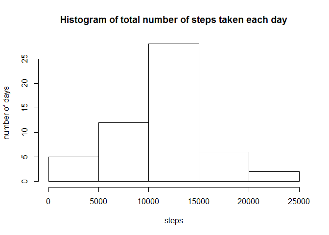
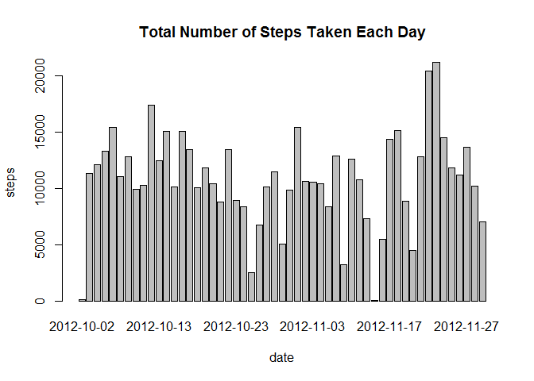
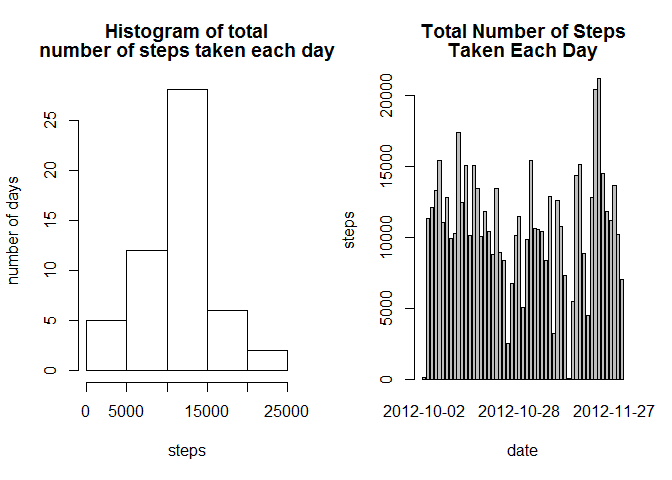
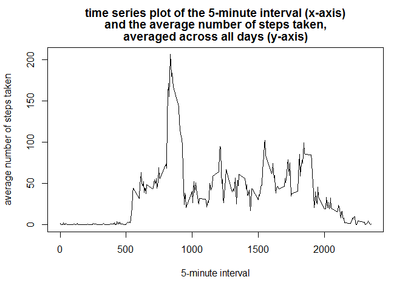

# Reproducible Research: Peer Assessment 1
Kamarul Ariffin Mansor  
Sunday, February 08, 2015  

This is an R Markdown document. Markdown is a simple formatting syntax for authoring HTML, PDF, and MS Word documents. For more details on using R Markdown see <http://rmarkdown.rstudio.com>.

## Assignment

This assignment will be described in multiple parts. You will need to write a report that answers the questions detailed below. Ultimately, you will need to complete the entire assignment in a single R markdown document that can be processed by knitr and be transformed into an HTML file.

Throughout your report make sure you always include the code that you used to generate the output you present. When writing code chunks in the R markdown document, always use echo = TRUE so that someone else will be able to read the code. This assignment will be evaluated via peer assessment so it is essential that your peer evaluators be able to review the code for your analysis.

For the plotting aspects of this assignment, feel free to use any plotting system in R (i.e., base, lattice, ggplot2)

Fork/clone the GitHub repository created for this assignment. You will submit this assignment by pushing your completed files into your forked repository on GitHub. The assignment submission will consist of the URL to your GitHub repository and the SHA-1 commit ID for your repository state.

**NOTE:** The GitHub repository also contains the dataset for the assignment so you do not have to download the data separately.

#### Loading and preprocessing the data

Show any code that is needed to

- Load the data (i.e. read.csv())

```r
setwd("C:\\Users\\MSI\\RepData_PeerAssessment1\\")
getwd()
```

```
## [1] "C:/Users/MSI/RepData_PeerAssessment1"
```

```r
unzip("activity.zip")
data_activity <- read.csv("activity.csv", header = TRUE)
dim(data_activity)
```

```
## [1] 17568     3
```

```r
names(data_activity)
```

```
## [1] "steps"    "date"     "interval"
```

```r
head(data_activity)
```

```
##   steps       date interval
## 1    NA 2012-10-01        0
## 2    NA 2012-10-01        5
## 3    NA 2012-10-01       10
## 4    NA 2012-10-01       15
## 5    NA 2012-10-01       20
## 6    NA 2012-10-01       25
```

- Process/transform the data (if necessary) into a format suitable for your analysis

#### What is mean total number of steps taken per day?

For this part of the assignment, you can ignore the missing values in the dataset.

1. Calculate the total number of steps taken per day

```r
steps.date <- aggregate(steps ~ date, data = data_activity, FUN = sum)
head(steps.date)
```

```
##         date steps
## 1 2012-10-02   126
## 2 2012-10-03 11352
## 3 2012-10-04 12116
## 4 2012-10-05 13294
## 5 2012-10-06 15420
## 6 2012-10-07 11015
```

2. If you do not understand the difference between a histogram and a barplot, research the difference between them. Make a histogram of the total number of steps taken each day

```r
hist(steps.date$steps, main = "Histogram of total number of steps taken each day", xlab = "steps", ylab = "number of days")
```

 

```r
barplot(steps.date$steps, names.arg = steps.date$date, main = "Total Number of Steps Taken Each Day", xlab = "date", ylab = "steps")
```

 

Panel plot side by side for clearer plots comparison

```r
par(mfrow = c(1, 2))
hist(steps.date$steps, 
     main = rbind("Histogram of total", "number of steps taken each day"), 
     xlab = "steps", ylab = "number of days")
barplot(steps.date$steps, names.arg = steps.date$date, main = rbind("Total Number of Steps", "Taken Each Day"), xlab = "date", ylab = "steps")
```

 

Based on the plots of histogram and barplot, we can differentiate between them.  Histogram will give a distribution of number of day for a certain range of steps while barplot will show the frequency of steps for each days available.

3. Calculate and report the mean and median of the total number of steps taken per day

```r
mean(steps.date$steps)
```

```
## [1] 10766.19
```

```r
median(steps.date$steps)
```

```
## [1] 10765
```

#### What is the average daily activity pattern?

1. Make a time series plot (i.e. type = "l") of the 5-minute interval (x-axis) and the average number of steps taken, averaged across all days (y-axis)

```r
steps.interval <- aggregate(steps ~ interval, data = data_activity, FUN = mean)
plot(
  steps.interval, 
  type = "l", 
  main = rbind("time series plot of the 5-minute interval (x-axis)", 
               "and the average number of steps taken,",
               "averaged across all days (y-axis)"), 
  xlab = "5-minute interval", 
  ylab = "average number of steps taken")
```

 

2. Which 5-minute interval, on average across all the days in the dataset, contains the maximum number of steps?

```r
steps.interval$interval[which.max(steps.interval$steps)]
```

```
## [1] 835
```

#### Imputing missing values

Note that there are a number of days/intervals where there are missing values (coded as NA). The presence of missing days may introduce bias into some calculations or summaries of the data.

1. Calculate and report the total number of missing values in the dataset (i.e. the total number of rows with NAs)

```r
sum(is.na(data_activity))
```

```
## [1] 2304
```

2. Devise a strategy for filling in all of the missing values in the dataset. The strategy does not need to be sophisticated. For example, you could use the mean/median for that day, or the mean for that 5-minute interval, etc.

```r
# Using the means for the 5-minute interval for filling in all of the missing values.
data_activity <- merge(data_activity, steps.interval, 
                       by = "interval", suffixes = c("", ".y"))
nas <- is.na(data_activity$steps)
```

3. Create a new dataset that is equal to the original dataset but with the missing data filled in.

```r
data_activity$steps[nas] <- data_activity$steps.y[nas]
data_activity <- data_activity[, c(1:3)]
```

4. Make a histogram of the total number of steps taken each day and Calculate and report the mean and median total number of steps taken per day. Do these values differ from the estimates from the first part of the assignment? What is the impact of imputing missing data on the estimates of the total daily number of steps?

```r
steps.date <- aggregate(steps ~ date, data = data_activity, FUN = sum)
barplot(steps.date$steps, names.arg = steps.date$date, xlab = "date", ylab = "steps")
```

 

```r
mean(steps.date$steps)
```

```
## [1] 10766.19
```

```r
median(steps.date$steps)
```

```
## [1] 10766.19
```

The impact of imputing missing data by filling them with means from the 5-minute interval seem to be a low impact on both the mean and the median statistic estimates of the total daily number of steps.

#### Are there differences in activity patterns between weekdays and weekends?

For this part the weekdays() function may be of some help here. Use the dataset with the filled-in missing values for this part.

1. Create a new factor variable in the dataset with two levels - "weekday" and "weekend" indicating whether a given date is a weekday or weekend day.

```r
type_of_day <- function(date) {
  if (weekdays(as.Date(date)) %in% c("Sabtu", "Ahad")) {"weekend"} 
  else {"weekday"}
}
data_activity$type_of_day <- as.factor(sapply(data_activity$date, type_of_day))
```

2. Make a panel plot containing a time series plot (i.e. type = "l") of the 5-minute interval (x-axis) and the average number of steps taken, averaged across all weekday days or weekend days (y-axis). See the README file in the GitHub repository to see an example of what this plot should look like using simulated data.

```r
par(mfrow = c(2, 1))
for (type in c("weekend", "weekday")) {steps.type <- aggregate(steps ~ interval, data =
data_activity, subset = data_activity$type_of_day == type, FUN = mean)
plot(steps.type, type = "l", main = type)
}
```

 

### Submitting the Assignment

To submit the assignment:

1. Commit the your completed PA1_template.Rmd file to the master branch of your git repository (you should already be on the master branch unless you created new ones)

2. Commit your PA1_template.md and PA1_template.html files produced by processing your R markdown file with knit2html() function in R (from the knitr package) by running the function from the console.

3. If your document has figures included (it should) then they should have been placed in the figure/ directory by default (unless you overrided the default). Add and commit the figure/ directory to your git repository so that the figures appear in the markdown file when it displays on github.

4. Push your master branch to GitHub.

5. Submit the URL to your GitHub repository for this assignment on the course web site.

In addition to submitting the URL for your GitHub repository, you will need to submit the 40 character SHA-1 hash (as string of numbers from 0-9 and letters from a-f) that identifies the repository commit that contains the version of the files you want to submit. You can do this in GitHub by doing the following

1. Going to your GitHub repository web page for this assignment

2. Click on the "?? commits" link where ?? is the number of commits you have in the repository. For example, if you made a total of 10 commits to this repository, the link should say "10 commits".

3. You will see a list of commits that you have made to this repository. The most recent commit is at the very top. If this represents the version of the files you want to submit, then just click the "copy to clipboard" button on the right hand side that should appear when you hover over the SHA-1 hash. Paste this SHA-1 hash into the course web site when you submit your assignment. If you don't want to use the most recent commit, then go down and find the commit you want and copy the SHA-1 hash.
